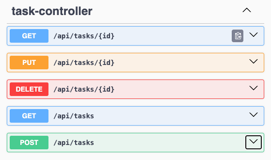
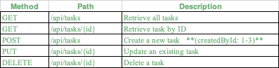
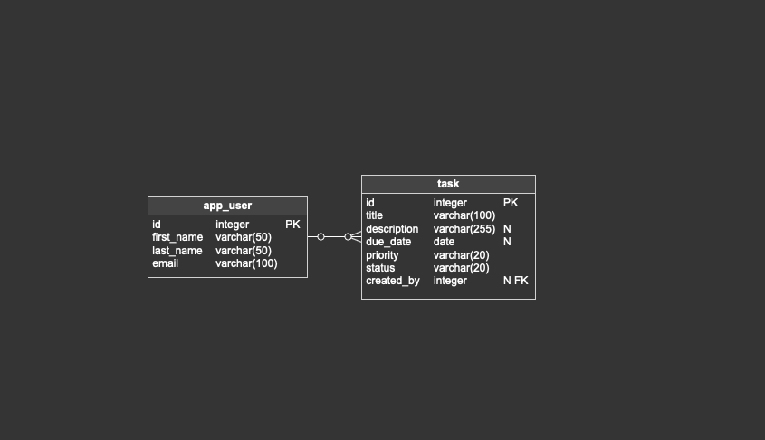

# Task Tracker

## Table of Contents
1. [Overview](#overview)
2. [Features](#features)
3. [Technology Stack](#technology-stack)
4. [Project Structure](#project-structure)
5. [How to Run](#how-to-run)
6. [API Endpoints](#api-endpoints)
7. [Database Initialization](#database-initialization)
8. [API Documentation](#api-documentation-swagger-ui)
9. [Troubleshooting](#troubleshooting)

## Overview
A Spring Boot application that provides a simple task management REST API. 
It allows you to create, update, delete, and retrieve tasks, with optional association to users. 
The application uses HSQLDB (in-memory) for persistence and initializes schema and sample data on startup.

-----------------------------------------------------------------

## Features
- RESTful CRUD API for Tasks
- DTO-based API for clean JSON responses
- In-memory HSQLDB with schema and sample data loaded automatically
- Swagger UI for interactive API documentation
- Layered architecture: Controller → Service → Repository → Entity
- Configurable via application.properties

-----------------------------------------------------------------

## Technology Stack
- Java 21
- Spring Boot 3.5.0
- Spring Data JPA
- HSQLDB 2.7.3
- Gradle
- Springdoc OpenAPI (Swagger UI)

-----------------------------------------------------------------

## Project Structure
```
myproject/
├── build.gradle# Gradle build configuration
├── settings.gradle
└── src
    ├── main
    │   ├── java/eu/itcrafters/myproject/
    │   │   ├── MyprojectApplication.java
    │   │   ├── controller/
    │   │   │   └── TaskController.java
    │   │   ├── dto/
    │   │   │   └── TaskDTO.java
    │   │   ├── entity/
    │   │   │   ├── AppUser.java
    │   │   │   └── Task.java
    │   │   ├── repository/
    │   │   │   ├── AppUserRepository.java
    │   │   │   └── TaskRepository.java
    │   │   ├── service/
    │   │   │   └── TaskService.java
    │   │   └── infrastructure/
    │   │       ├── db/HsqlServerConfig.java
    │   │       ├── rest/OpenApiConfig.java
    │   │       ├── rest/RestExceptionHandler.java
    │   │       └── rest/error/ApiError.java, Error.java
    │   └── resources/
    │       ├── application.properties
    │       ├── schema.sql
    │       └── data.sql
    └── test/java/... (if any)
```

-----------------------------------------------------------------

## How to Run

**Prerequisites**
- Java 21+
- Gradle (or use included wrapper: ./gradlew)

Start the application:
```bash
./gradlew bootRun
```

By default, the app runs on port 8080.  
To change the port, edit `src/main/resources/application.properties`:

```properties
server.port=8081
```

-----------------------------------------------------------------

## API Endpoints

Base URL: http://localhost:8080/swagger-ui/index.html




Sample POST request:
```bash
curl -X POST http://localhost:8080/api/tasks -H "Content-Type: application/json" -d '{
"title": "Write documentation",
"description": "Add full project README",
"dueDate": "2025-09-01",
"priority": "high",
"status": "open",
"createdById": 1
}'
```

-----------------------------------------------------------------

## Database Initialization
- HSQLDB (in-memory): jdbc:hsqldb:mem:mydb
- Schema auto-loaded from: src/main/resources/schema.sql
- Sample data from: src/main/resources/data.sql

📦 Database Structure (ER-diagram)


Tables:
- app_user (users)
- task (tasks, with optional created_by foreign key)

-----------------------------------------------------------------

## API Documentation (Swagger UI)
Once the app is running, access Swagger at:

http://localhost:8080/swagger-ui/index.html

-----------------------------------------------------------------

## Troubleshooting
- **Port 8080 already in use:**
  ```bash
  lsof -iTCP:8080 -sTCP:LISTEN
  kill -9 <PID>
  ```

- **Swagger /v3/api-docs error:**
  Ensure:
  - springdoc-openapi-starter-webmvc-ui is in build.gradle.
  - OpenApiConfig bean exists.
  - Entities avoid infinite loops (use @JsonIgnore for bidirectional relationships).
